<div align="center">

# 🌸 Notes & Sillage — Catálogo Digital de Fragancias

**Emprendimiento propio de venta de perfumes en Chile**  
*Notas que cautivan, una estela que perdura.*

[](https://developer.mozilla.org/es/docs/Web/HTML)
[](https://developer.mozilla.org/es/docs/Web/CSS)
[](https://developer.mozilla.org/es/docs/Web/JavaScript)
[](https://wa.me/)
[](https://pages.github.com/)

[🌐 Ver el catálogo en vivo](https://deralexsander.github.io/notes-and-sillage/)

</div>

---

## 📌 1. ¿Qué es Notes & Sillage?

**Notes & Sillage** es un emprendimiento propio de venta de perfumes. Este repositorio contiene el **catálogo digital** que uso para mostrar mis fragancias a los clientes y recibir pedidos de forma simple, sin depender de una tienda online compleja.

El problema que resuelve es muy concreto: compartir una lista de perfumes por mensajes es lento y desordenado. Con este catálogo, el cliente puede explorar los aromas, ver imágenes, elegir el tamaño, armar su pedido y enviármelo ya redactado por WhatsApp.

Es un sitio **100 % estático** (HTML, CSS y JavaScript). No necesita servidor, base de datos ni backend, por lo que es gratuito de alojar y muy rápido. Está pensado primero para **celulares**, que es desde donde mis clientes lo abren.

### Portada del catálogo
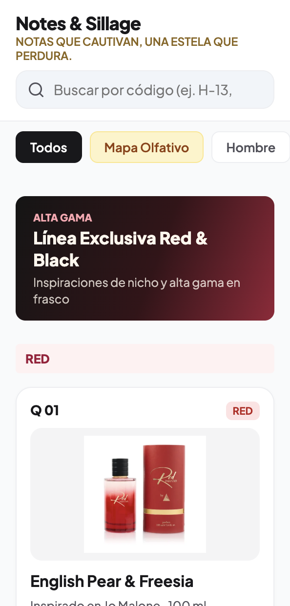
*Vista inicial: buscador, categorías en pestañas horizontales y tarjetas de producto con imagen, nombre, tamaño y precio.*

---

## ✨ 2. Funcionalidades

| Funcionalidad | Descripción |
| :--- | :--- |
| 🔎 **Búsqueda inteligente** | Busca por nombre del perfume, código (ej. `H-13`, `F01`) o aroma. Normaliza tildes y variantes del código. |
| 💡 **Corrección de búsqueda** | Si no hay resultados, sugiere el nombre más parecido de la base de datos (ej. `sandal 33` → «¿Quisiste decir Santal 33?»). |
| 🌿 **Notas olfativas** | Las tarjetas de la Línea Red & Black muestran, igual que Hombre y Mujer, puntos de color y la familia olfativa (ej. «Maderoso Aromático»). |
| 🗂️ **Categorías** | Hombre, Mujer, Línea Red & Black, Línea Teen, Colonia Hombre, Colonia Mujer y Splash. |
| 🧭 **Mapa Olfativo** | Brújula visual que agrupa las fragancias por intensidad y familia olfativa. |
| 🧴 **Selección de tamaño** | Cada perfume se ofrece en 100 ml, 50 ml y 20 ml, con el precio actualizado según el formato. |
| 🖼️ **Imagen del aroma** | Alterna entre la foto del frasco y la imagen de inspiración visual de las notas. |
| 🛒 **Carrito de pedido** | Barra flotante con total, edición de cantidades y opción para quitar o vaciar productos. |
| 💬 **Pedido por WhatsApp** | Genera el mensaje con el detalle del pedido, el total y el nombre del cliente. |
| ✅ **Confirmación de envío** | Pregunta si el pedido está terminado antes de abrir WhatsApp y vacía el carrito al enviar. |
| 🔄 **Cambiar o cancelar pedido** | Asistente guiado, unidad por unidad, que elige el reemplazo desde el catálogo y envía la solicitud por WhatsApp. |

---

## 🔎 3. Búsqueda por Nombre, Código o Aroma

Cada fragancia tiene un código corto (por ejemplo `H-13` para hombre o `F-01` para mujer). El cliente puede escribirlo tal como lo conoce, con o sin guion, y el catálogo lo encuentra al instante.

| Búsqueda por código | Catálogo por categoría |
| :---: | :---: |
| 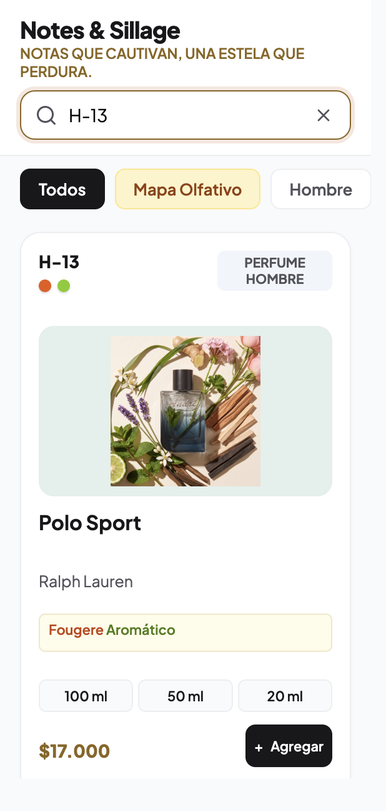 | 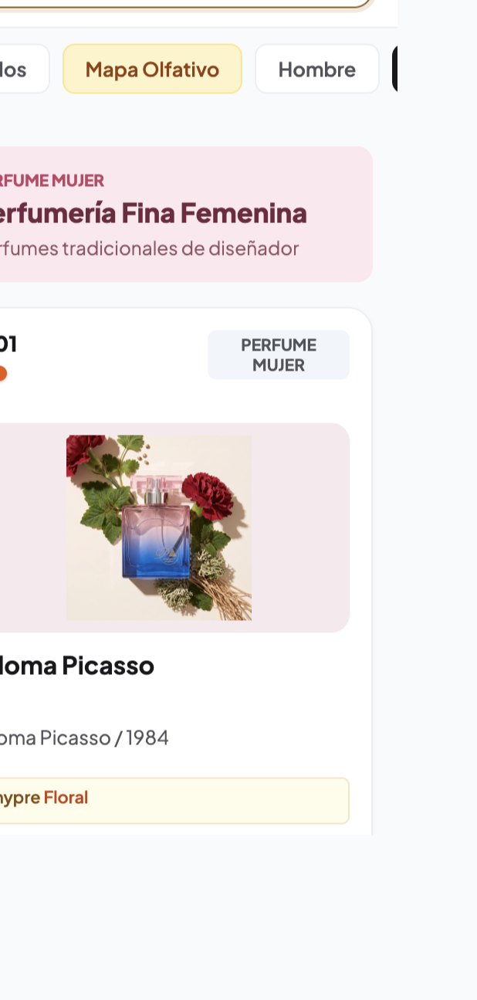 |
| *Resultado inmediato al escribir `H-13`, con botón para borrar la búsqueda.* | *Perfumería fina femenina con familia olfativa, tamaños y precio por tarjeta.* |

### ¿Quisiste decir...?

El buscador indica que se puede escribir el **nombre del perfume**, el código o el aroma. Si el texto tiene un error de tipeo y no encuentra nada, el catálogo propone el nombre más parecido **solo entre los perfumes de la base de datos**. Al tocar la sugerencia se completa la búsqueda y se muestra el resultado.

| Texto del buscador | Sugerencia de corrección |
| :---: | :---: |
| 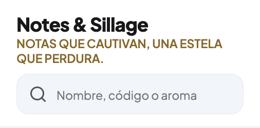 | 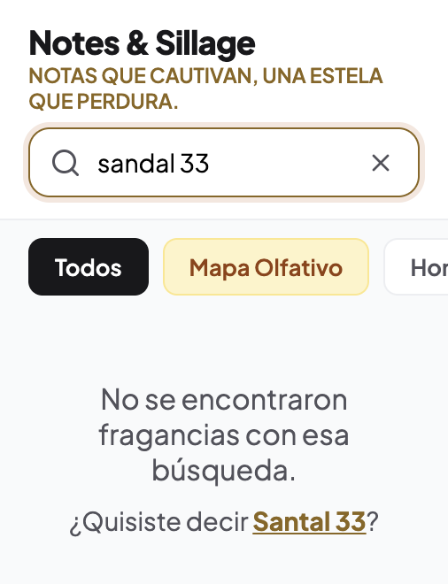 |
| *Texto de ayuda breve para que se lea completo en el celular.* | *Al escribir `sandal 33` sugiere `Santal 33`.* |

### Notas olfativas (Red & Black)

Cada perfume de la Línea Red & Black muestra, igual que Hombre y Mujer, **puntos de color** junto al código y su **familia olfativa** (ej. `Maderoso Aromático`). Los datos están en `js/base-datos.js`.

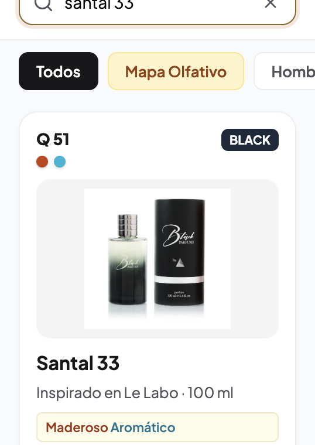

---

## 🧭 4. Mapa Olfativo

Para ayudar a quien no sabe qué elegir, el catálogo incluye un **mapa olfativo** separado en **Fragancias Femeninas** y **Fragancias Masculinas**. Ordena los perfumes de **ligero/fresco a intenso/cálido** y los agrupa por familia, con una leyenda de colores para reconocerlas de un vistazo.

Familias consideradas: Cítrico, Frutal, Chypre, Floral, Verde, Maderoso, Oriental, Fougère, Aldehídico, Aromático y Especiado.

| Mapa Femenino | Mapa Masculino |
| :---: | :---: |
| 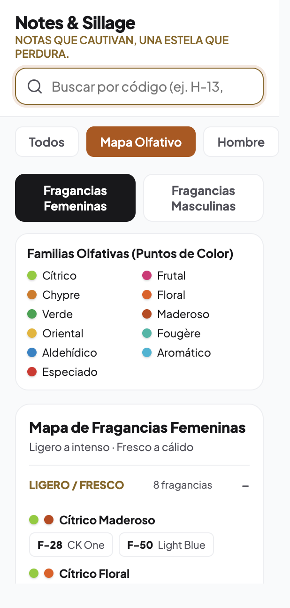 | 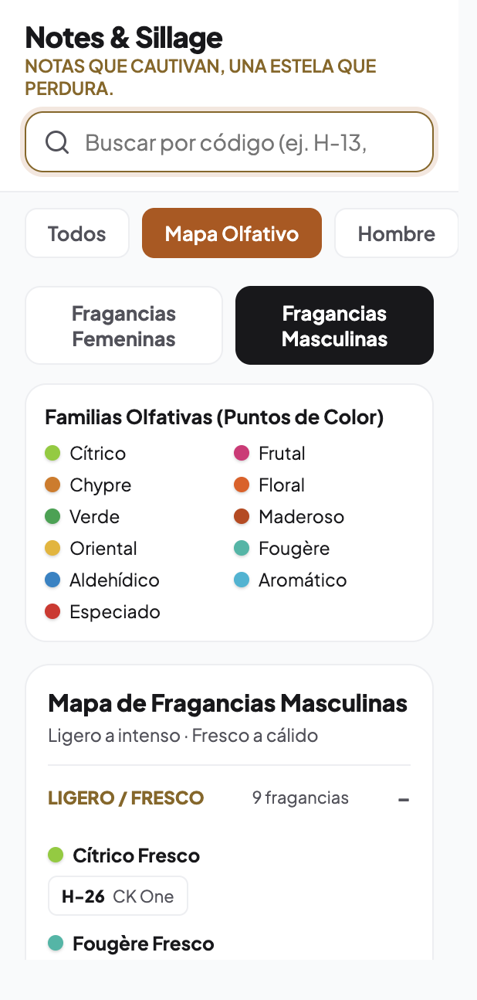 |
| *Leyenda de colores y grupos de fragancias por intensidad.* | *Misma lógica aplicada a la línea masculina.* |

---

## 🛒 5. Carrito y Pedido por WhatsApp

El cliente agrega productos y ve una barra flotante con la cantidad y el total. Al abrirla puede ajustar cantidades, quitar productos y escribir su **nombre y apellido** (campo obligatorio). Al presionar **Pedir por WhatsApp**, se abre la conversación con el pedido ya redactado.

| Barra flotante del carrito | Resumen del pedido |
| :---: | :---: |
| 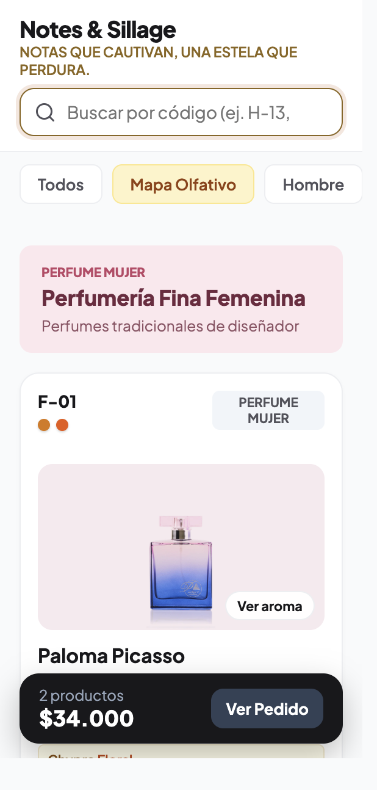 | 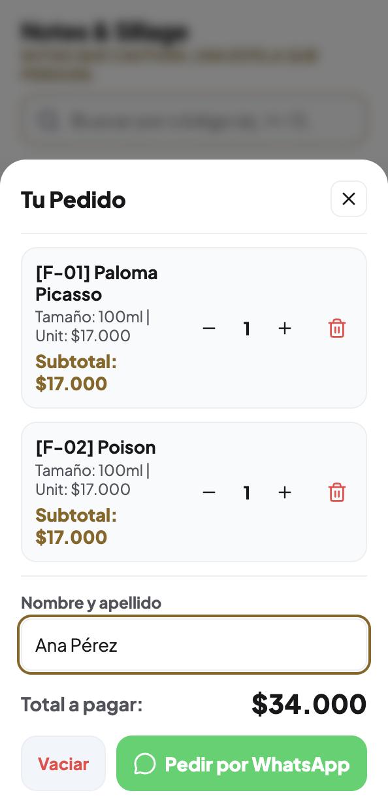 |
| *Muestra cuántos productos hay y el total acumulado.* | *Edición de cantidades, nombre del cliente y botón de envío por WhatsApp.* |

### Confirmación antes de enviar
Como el cliente puede arrepentirse después de abrir WhatsApp, al presionar **Pedir por WhatsApp** aparece primero la pregunta **«¿Ya terminaste tu pedido?»**:

- **Volver al pedido:** cierra el aviso y deja seguir agregando, editando o quitando productos.
- **Sí, enviar:** abre WhatsApp con el pedido redactado y **vacía el carrito** para empezar de cero.

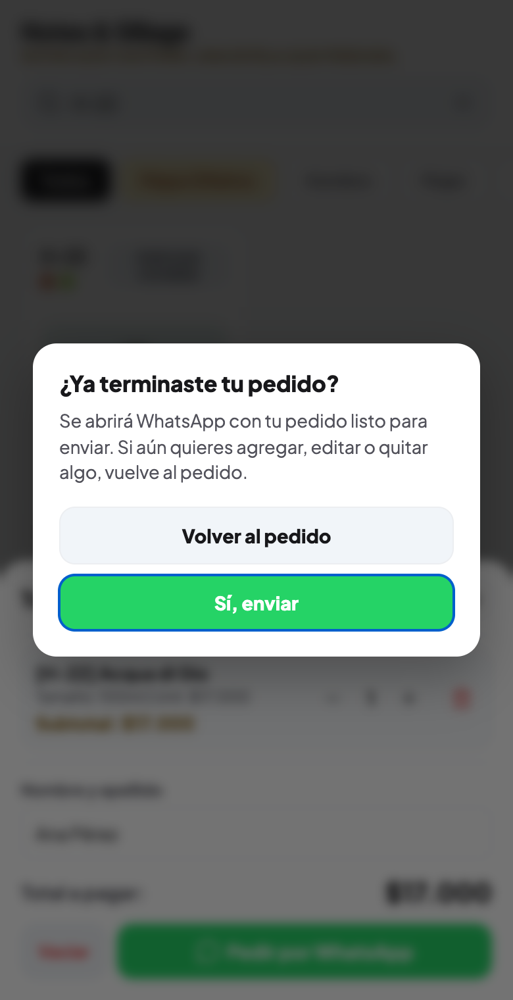

---

## 🔄 6. Cambiar o Cancelar un Pedido

Como el catálogo no guarda memoria del comprador, un globo **«i»** fijo abajo a la derecha guía a quien ya pidió y quiere cambiar o cancelar algo.

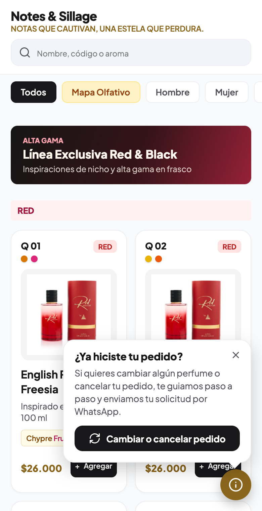

### Cómo funciona
1. **Marcar lo que pidió:** el catálogo pasa a *modo cambio*. Una barra fija inferior (que no molesta al buscar ni escribir) muestra cuántos perfumes se marcaron. Las tarjetas muestran **Lo pedí**; se puede cambiar el tamaño y la cantidad de cada uno.
2. **Decidir unidad por unidad:** cada unidad pedida tiene su propia decisión: **Se mantiene**, **Cambiar** o **Cancelar**. Así, si pidió 2 unidades del mismo perfume, puede mantener 1 y cambiar la otra por otro aroma.
3. **Elegir el reemplazo en el catálogo:** el perfume nuevo **no se escribe**, solo se elige tocando **Elegir este** en el catálogo. **Continuar** queda bloqueado mientras falte algún reemplazo.
4. **Revisar y enviar:** se escribe nombre y apellido y se confirma con **«¿Ya terminaste tu cambio o cancelación?»**. Al aceptar se abre WhatsApp y se limpia todo lo marcado.

| Modo cambio en el catálogo | Decisión por unidad |
| :---: | :---: |
| 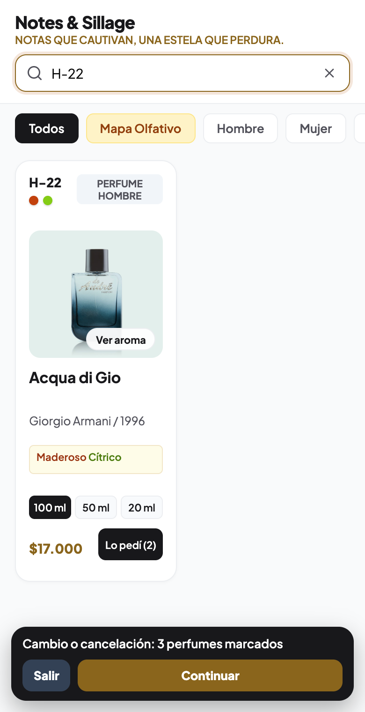 | 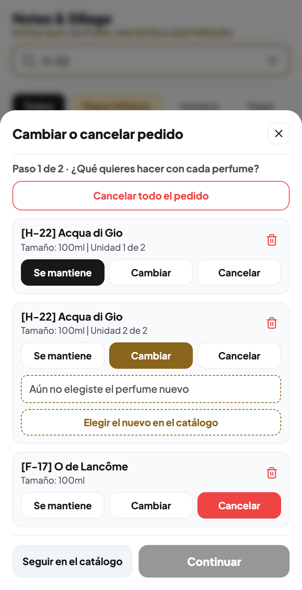 |
| *Barra fija con el contador y los botones Salir / Continuar.* | *Unidad 1 se mantiene, unidad 2 se cambia y otro perfume se cancela.* |

| Resumen y envío | Confirmación |
| :---: | :---: |
| 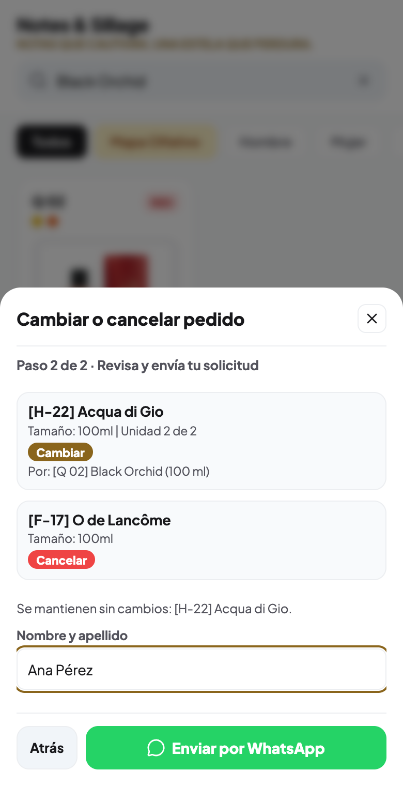 | 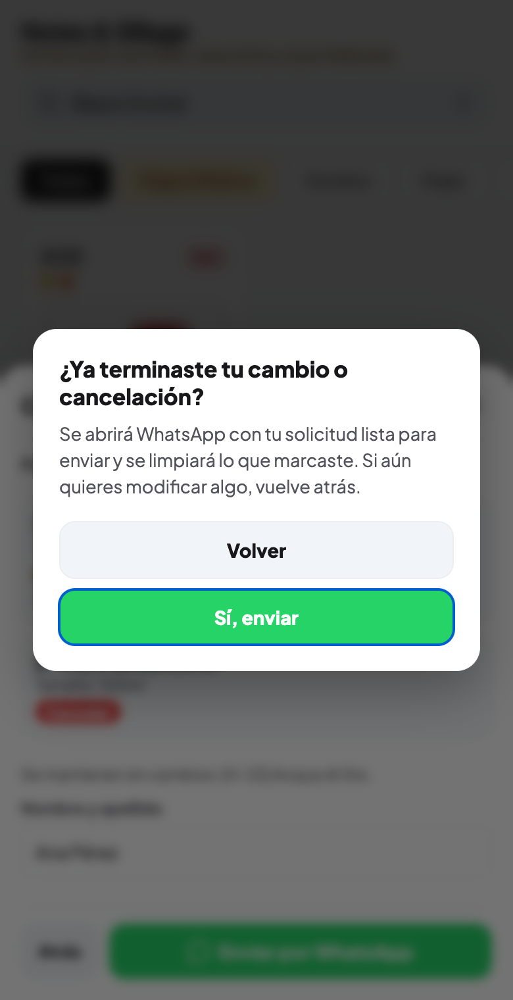 |
| *Detalle de lo que cambia, nombre del cliente y envío.* | *Pregunta final antes de abrir WhatsApp.* |

El mensaje que llega al vendedor agrupa las unidades iguales, por ejemplo:

```text
¡Hola! Soy Ana Pérez y quiero cambiar este pedido:

1. [H-22] Acqua di Gio (100ml) x1 → se mantiene
2. [H-22] Acqua di Gio (100ml) x1 → CAMBIAR por: [Q 02] Black Orchid (100 ml)
```

---

## 🛠️ 7. Tecnologías

| Capa | Tecnología |
| :--- | :--- |
| **Estructura** | HTML5 semántico |
| **Estilos** | CSS3 (diseño responsive, mobile first) |
| **Lógica** | JavaScript (ES6+), sin frameworks |
| **Íconos** | [Lucide](https://lucide.dev/) |
| **Tipografía** | Plus Jakarta Sans (Google Fonts) |
| **Pedidos** | Enlace `wa.me` con mensaje prellenado |
| **Alojamiento** | GitHub Pages |

---

## 📂 8. Estructura del Proyecto

```text
notes-and-sillage/
├── index.html           # Página principal del catálogo
├── css/
│   └── estilos.css      # Estilos y diseño responsive
├── js/
│   ├── base-datos.js    # Catálogo: productos, precios y datos del vendedor
│   └── app.js           # Búsqueda, mapa olfativo, carrito y envío a WhatsApp
├── img/                 # Fotos de frascos e imágenes de inspiración por aroma
└── docs/img/            # Capturas usadas en este README
```

---

## 🚀 9. Ejecutar Localmente

Al ser un sitio estático no requiere instalar dependencias. Solo necesitas un servidor local simple:

```bash
git clone https://github.com/deralexsander/notes-and-sillage.git
cd notes-and-sillage
python3 -m http.server 8000
```

Luego abre `http://localhost:8000` en el navegador.

### Actualizar el catálogo
Los productos, precios y el número de contacto se definen en [`js/base-datos.js`](./js/base-datos.js). Para agregar o modificar un perfume basta con editar ese archivo y subir las imágenes a `img/`.

---

## 🌐 10. Despliegue

El sitio se publica con **GitHub Pages** desde la rama `main`. Cada `git push` actualiza el catálogo en uno o dos minutos:

👉 **https://deralexsander.github.io/notes-and-sillage/**

---

<div align="center">

Hecho con dedicación para **Notes & Sillage** 🌸  
Desarrollado por [Alexsander Muñoz](https://github.com/deralexsander)

</div>
